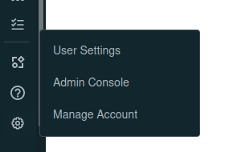
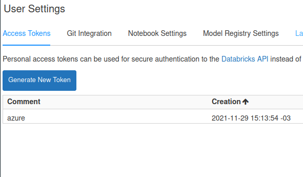
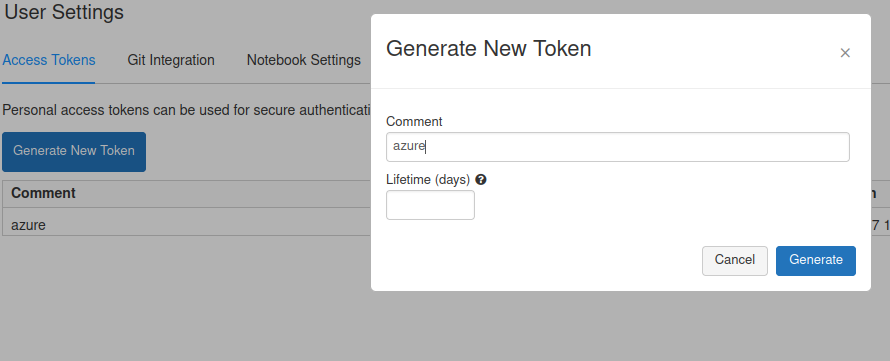
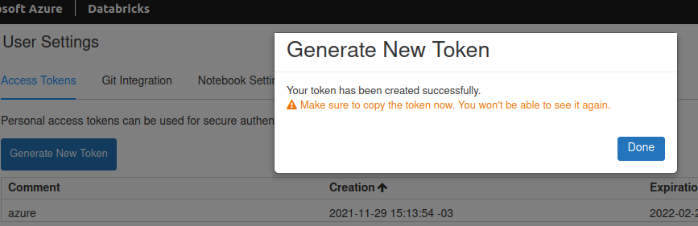
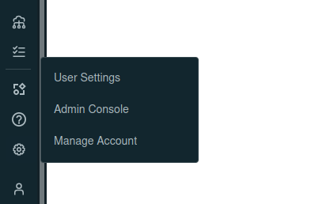
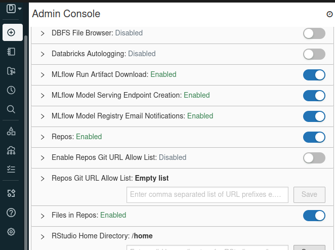

# Databricks Deploy with Terraform

Esse repositório é um template de Terraform para realizar o deploy de conexão de repositórios git com o Databricks.

## Definição do wrapper

O wrapper encapsula os seguintes módulos com base na sua responsabilidade?

- `repository`: Responsável por criar o vínculo entre um repositório git com o Databricks.
    - Repositório `nome-do-repositorio` extratido do parâmetro `repository.url="https://nome-provider.com.br/nome-do-repositorio.git"`.
- `cluster`: Responsável por criar um cluster de workers para execução de um job.
    - Cluster `cls-nome-do-projeto`.
- `job`: Responsável por criar um job databricks à partir de um notebook.
    - Job `job-nome-do-job-nome-do-projeto`.

## Configuração do Databricks

Para exemplificar a configuração, foi utilizado o serviço da Azure de Databricks.

### Criação de token

No menu lateral esquerdo, clicar em *Settings* > *User Settings*:



Na aba *Access Tokens*, clicar em *Generate New Token*:



Ao gerar o token, deixar o parâmtro *Lifetime* como vazio para o token não expirar:



É necessário salvar o token para uso posterior,



### Habilitar arquivos no repositório

Para que seja possível registrar repositórios com qualquer tipo de arquivo, é necessário habilitar essa configuração no painel administrativo do Databricks.

No menu lateral esquerdo, clicar em *Settings* > *User Settings*:



Na aba *Workspace Settings*, habilitar a flag *Files in Repo*:



## Como utilizar?

Será utilizado o repositório `meurepositorio` para fins de explicação. O `meurepositorio` contém a seguinte estrutura:

```
meurepositorio
│   configuration.tfvars    
│
└───scripts
    │   script1.py
```

## script1

Contém o código fonte que será enviado ao databricks. Para fins de exemplo, será utilizado o seguinte código:

```python
# Databricks notebook source
lines = sc.textFile('dbfs:/databricks-datasets/SPARK_README.md')
lines.take(10)

# COMMAND ----------

numPartitions = lines.getNumPartitions()
print('Number of partitions (workers) storing the dataset = %d' % numPartitions)

# COMMAND ----------

words = lines.flatMap(lambda x: x.split(' '))
words.take(10)

# COMMAND ----------

stopWords = ['','a','*','and','is','of','the','a'] # define the list of stop words
filteredWords = words.filter(lambda x: x.lower() not in stopWords) # filter the words
filteredWords.take(10) # display the first 10 filtered words


# COMMAND ----------

filteredWords.cache() # cache filtered dataset into memory across the cluster worker nodes


# COMMAND ----------

word1Tuples = filteredWords.map(lambda x: (x, 1)) # map the words into (word,1) tuples
word1Tuples.take(10) # display the (word,1) tuples


# COMMAND ----------

wordCountTuples = word1Tuples.reduceByKey(lambda x, y: x + y) # aggregate counts for each word
wordCountTuples.take(10) # display the first 10 (word,count) tuples

# COMMAND ----------

sortedWordCountTuples = wordCountTuples.top(10,key=lambda x: x[1]) # top 10 (word,count) tuples
[print(item) for item in sortedWordCountTuples]
```

Fonte: [Databricks - Hello World](https://databricks-prod-cloudfront.cloud.databricks.com/public/4027ec902e239c93eaaa8714f173bcfc/4954928053318020/3029198689315822/167703932442645/latest.html)

## configuration.tfvars

Contém a configuração de deploy, onde cada parâmetro será explicado no exemplo abaixo:

```tfvars
# Nome do workspace padrão desse projeto (no caso, /Repos/meudiretorio/meurepositorio. Caso não seja especificado, será utilizado /Repos/usuario/nome-repositorio)
worspace_folder = "meudiretorio"

# Definição da conexão com o repositório pertencente a esse workspace, onde:
#   - url: URL de acesso ao repositório
#   - git_provider: Nome do provedor git (ex. gitHub)
#   - branch: Nome da branch que dever ser utilizada
repository = {
    url         = "https://url-repositorio/meurepositorio.git"
    gitProvider = "gitHub"
    branch      = "master" 
}

# Definição do cluster para execução de jobs, onde:
#   - configuration: Runtime do cluster
#   - node: Configuração de infraestrutura do cluster
cluster = {
#   - use_ml: Se o node deve conter ML runtime
#   - genomics: Se o node deve conter Genomics runtime
#   - gpu: Se o node deve conter suporte a GPUs
#   - photon: Se o node deve conter Photon runtime
#   - version_scala: Versão do scala
#   - version_spark: Versão do spark
  configuration = {
    use_ml        = false
    use_genomics  = false
    use_gpu       = false
    use_photon    = false
    version_scala = "2.12"
    version_spark = "3"
  }
#   - local_disk: Utiliza apenas armazenamento local
#   - gb_per_core: Número de gigabytes por core disponível na instância
#   - min_gpus: Número minimo de CPUs disponíveis na instância
  node = {
    local_disk  = false
    gb_per_core = 0
    min_cores   = 0
    min_gpus    = 0
  }
#   - autotermination_minutes: Termina o cluster por inatividade após o tempo determinado
  autotermination_minutes = 15
#   - min: Quantidade mínima de instâncias
#   - max: Quantidade máxima de instâncias
  scaling = {
    min = 0
    max = 1
  }
}

# Definição do jobs, onde::
#   - name: Nome do job
#   - notebook: Diretório do script python dentro do repositório definido
jobs = [
  {
    name     = "job1"
    notebook = "scripts/main"
  }
]

```

### Configuração Pipeline

Para a criação do pipeline de deploy, fora utilizado uma ferramenta hipotética de deploy, que basicamente cria um pipeline para um repositório. No caso, o repositório que disparará esse pipeline será o `meurepositorio` (descrito acima).

```shell
# Instalar o terraform
sudo apt-get update && sudo apt-get install -y gnupg software-properties-common curl
curl -fsSL https://apt.releases.hashicorp.com/gpg | sudo apt-key add -
sudo apt-add-repository "deb [arch=amd64] https://apt.releases.hashicorp.com $(lsb_release -cs) main"
sudo apt-get update && sudo apt-get install terraform

# Baixar o repositório wrapper do terraform
git clone https://github.com/rubensmg/terraform-databricks.git

# Acessar o repositorio
cd terraform-databricks/

# Definir as variáveis de ambiente da AWS
export AWS_DEFAULT_REGION="us-east-1" 
export AWS_ACCESS_KEY="myaccesskey"
export AWS_SECRET_ACCESS_KEY="secretaccesskey"

# Definir as variáveis contendo as configurações para o wrapper do terraform
export REPOSITORY="meurepositorio" # Nome do repositório (evitar caracteres especiais pois será utilizado como nome do arquivo de estados do terraform)
export AWS_BUCKET="meubucket" # Nome do bucket na qual encontram-se todos os arquivos de estado do terraform
export DATABRICKS_HOST="https://meu-cluster.com" # URL do databricks que será feito o deploy
export DATABRICKS_TOKEN="mytoken" # Token criado anteriormente para acesso ao databricks

# Comando para realizar o deploy
make deploy
```

### Como excluir?

Após os testes, é possível eliminar todo o ambiente através dos comandos:

```shell
# Instalar o terraform
sudo apt-get update && sudo apt-get install -y gnupg software-properties-common curl
curl -fsSL https://apt.releases.hashicorp.com/gpg | sudo apt-key add -
sudo apt-add-repository "deb [arch=amd64] https://apt.releases.hashicorp.com $(lsb_release -cs) main"
sudo apt-get update && sudo apt-get install terraform

# Baixar o repositório wrapper do terraform
git clone https://github.com/rubensmg/terraform-databricks.git

# Acessar o repositorio
cd terraform-databricks/

# Definir as variáveis de ambiente da AWS
export AWS_DEFAULT_REGION="us-east-1" 
export AWS_ACCESS_KEY="myaccesskey"
export AWS_SECRET_ACCESS_KEY="secretaccesskey"

# Definir as variáveis contendo as configurações para o wrapper do terraform
export REPOSITORY="meurepositorio" # Nome do repositório (evitar caracteres especiais pois será utilizado como nome do arquivo de estados do terraform)
export AWS_BUCKET="meubucket" # Nome do bucket na qual encontram-se todos os arquivos de estado do terraform
export DATABRICKS_HOST="https://meu-cluster.com" # URL do databricks que será feito o deploy
export DATABRICKS_TOKEN="mytoken" # Token criado anteriormente para acesso ao databricks

# Comando para realizar o deploy
make drop
```